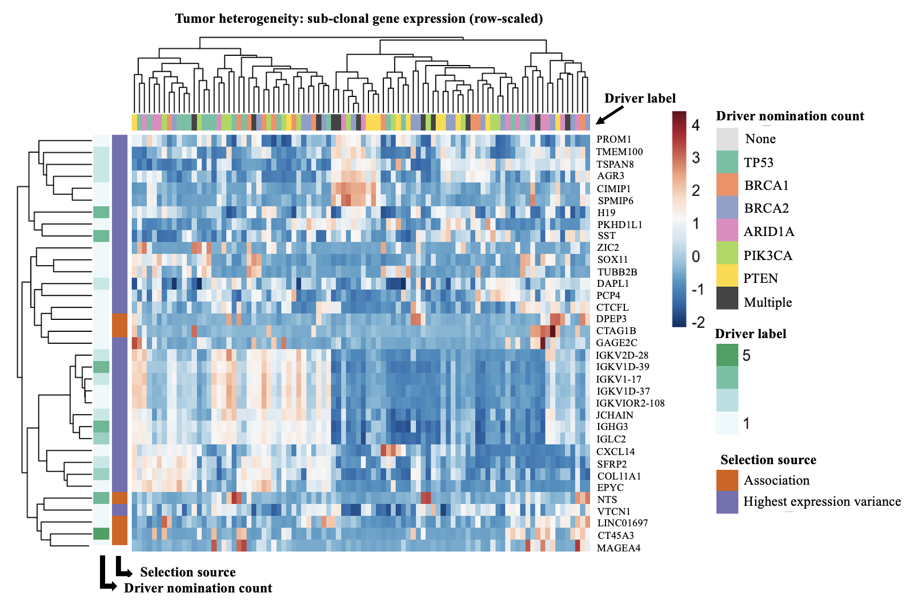
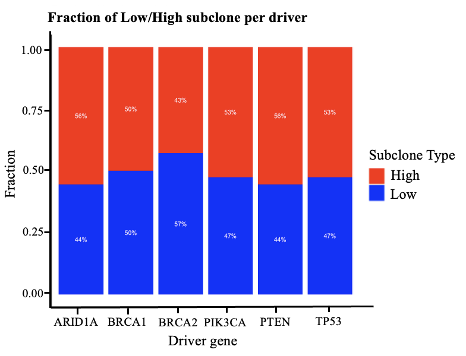
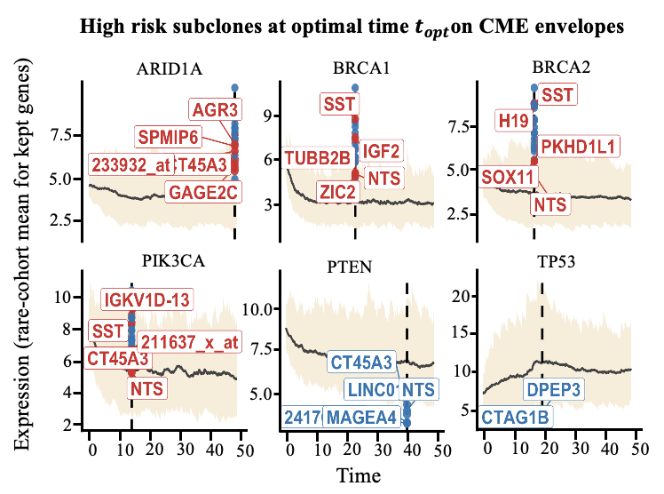

# magicSubclonal: Physics-Informed Subclone Discovery from Bulk Transcriptomes
magicSubclonal (Model-Aware, Gene-driven Inference of Clones and Subclones) is a physics-informed computational framework for identifying subclonal states and influential genes from bulk transcriptomic data. It models the stochastic dynamics of driver genes using the Chemical Master Equation (CME) to capture rare expression states, link them to non-driver genes, and quantify clinical risk. The framework delivers calibrated, reproducible, and biologically interpretable insights across diverse cancer types. 
$~~$
## Input Data 
magicSubclonal accepts two forms of input:  
1.	GEO Datasets: The loader handles GEO accessions in multiple formats and standardizes them into a consistent gene × sample expression matrix, where rows are HGNC gene symbols. When a processed GEO ExpressionSet (Series Matrix) is available, the rows may represent probes or gene IDs, and columns represent samples with numeric expression values.  

2.	Custom Gene Expression Matrices: Users can directly provide a gene expression matrix where rows correspond to gene names and columns to samples, containing normalized numeric expression values.  

## Runtime 
Runtime for magicSubclonal varies with dataset size, model settings (CME fitting, bootstrapping, resampling), and hardware configuration. On a MacBook Pro M2 Max (12-core CPU, 30/38-core GPU, up to 96 GB unified memory), processing took approximately 17, 8, 7, and 5 minutes for the ovarian (285 samples), lung (67 samples), DCIS (67 samples), and breast (19 samples) cohorts, respectively.  

$~~$

## Usage  
#-------------- 
**GEO-based assessment** 
#-------------- 
source("magicSubclonal_GEO.R") 
GEO_number <- "GSE9891"    

***List of driver genes*** 
genes_of_interest <- c("TP53","BRCA1","BRCA2","ARID1A","PIK3CA","PTEN") 

***Number of coloumn for visualization*** 
gene_column_number <- 3 

***Number of samples*** 
number_sample <- 75 

***Run*** 
run <- magicSubclonal_GEO(GEO_number, genes_of_interest, number_sample, gene_column_number) 

***List of subclone genes*** 
subclone_gene <- run$high_risk_genes_in_order_unique 
subclone_gene_GSE171415 <- subclone_gene 

***Example of visualization*** 

Heatmap_tumorHeterogeneity <- run$Heatmap_tumorHeterogeneity 
print(Heatmap_tumorHeterogeneity)

Barplot_tumorHeterogeneity <- run$Barplot_tumorHeterogeneity 
print(Barplot_tumorHeterogeneity) 

viz_subclone <- run$viz_subclone 
print(viz_subclone) 

$~~$

#-------------- 
**Data matrix assessment** 
#-------------- 
source("magicSubclonal_matrix.R") 
***List of driver genes*** 
genes_of_interest <- c("TP53","BRCA1","BRCA2","ARID1A","PIK3CA","PTEN") 

***Number of coloumn for visualization***   
gene_column_number <- 3 

***Number of samples*** 
number_sample <- 75 
run <- magicClonal_matrix(input_data_matrix, genes_of_interest, number_sample, gene_column_number) 

